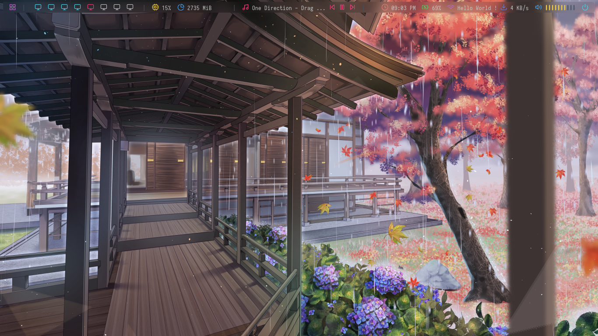
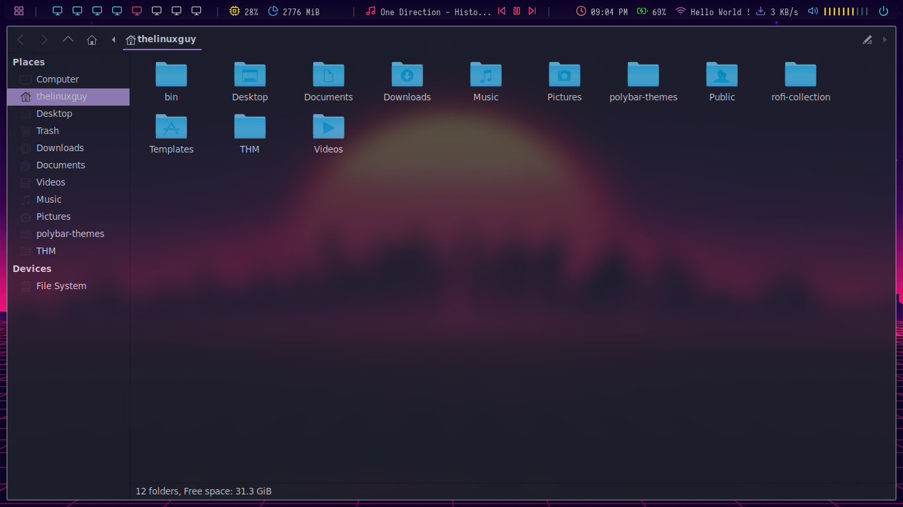
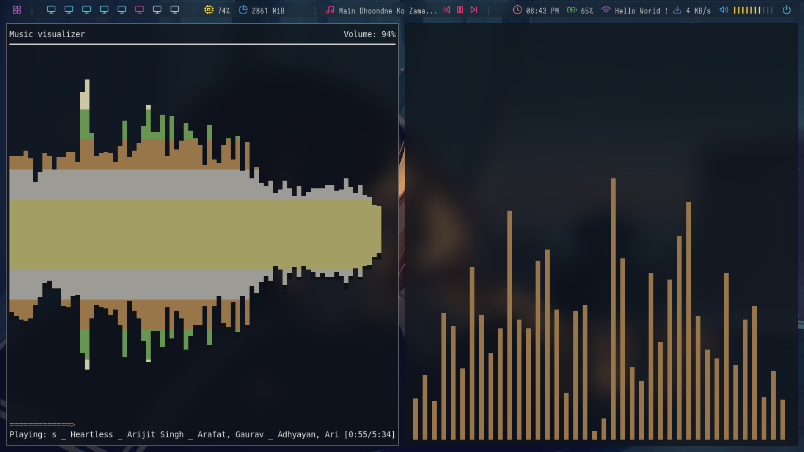
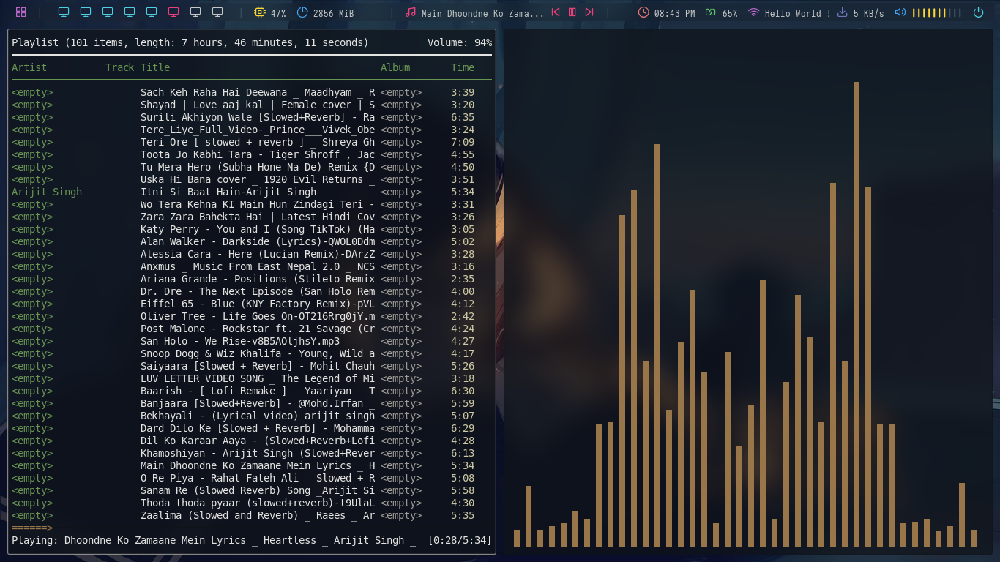
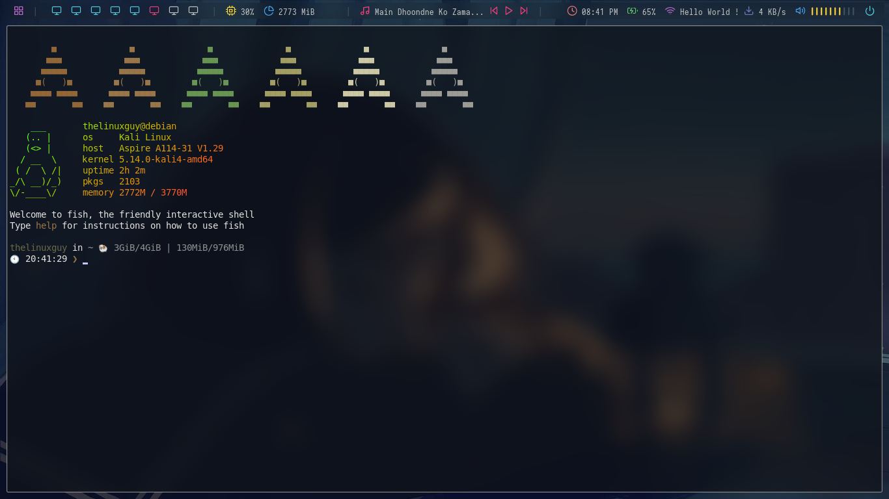
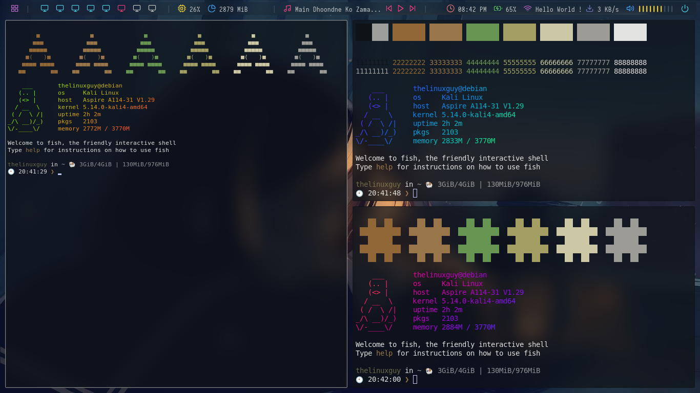
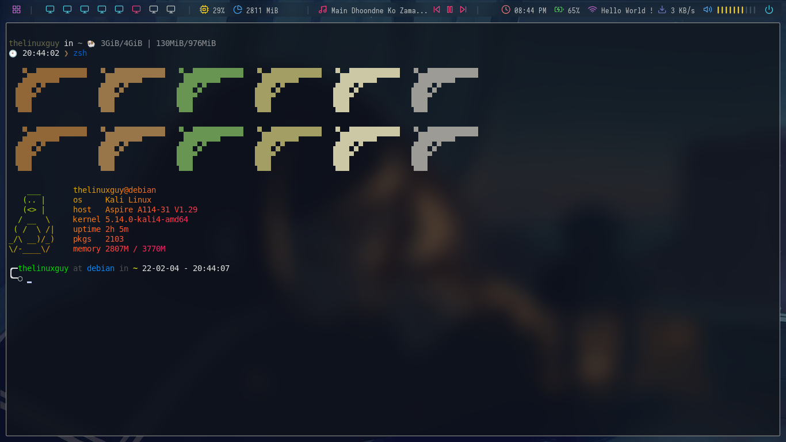

## Dotfiles for BSPWM window manager by Mangal Lopchan AKA TheLinuxGuy
#### Feedback are appreciated .... 
---
I have used random themes on the internet and customized according to my requirements . I like the things to be blurred and transparent and here is my setup ... I have configured everyting transparent and blured .. It tooks me almost a week to get everything ready And i have done this setup on my kali machine .

## Some Screenshots
### Transparent Polybar
   
### Transparent , Blured, Rounded corners around apps 
   
### Audio Visualizer with ncmpcpp [ CLI audio player ] and MPD [ Music Player Daemon ] on the polybar 
   
   
### Kitty Terminal Configuration with different shells and shell-color-scripts :
   
   
   

### Show Case Video 👇🏻👇🏻
---
<iframe width="745" height="400" src="https://www.youtube.com/embed/vDOyB-MoHI8" title="YouTube video player" frameborder="0" allow="accelerometer; autoplay; clipboard-write; encrypted-media; gyroscope; picture-in-picture" allowfullscreen></iframe>
---
# Installation 💻

### Important Dependencies 😍
You need to install all these on to your distro from official repository for third party repository 
---
* bspwm -> Tiling Window Manager / Dynamic Window Manager 🙀
* polybar -> Bar for light weight system 🙀
* rofi -> Application launcher 🙀
* dunst -> Notification daemon 🙀
* mpd -> Music player daemon 🎸
* ncmpcpp -> mpd client for handling with music , audio visualizer 🎸
* ranger -> CLI Filemanager 🙄
* kitty -> One of the Fastest Terminal for light weight system 💪🏻
* compton/picom -> compositor for better performance and better looks , blur and rounded corners and transparent background 🙀
* zsh/bash/fish -> shells for linux [ choose according to your comfort and choice 🥰 ]
* nitrogen -> application for setting wallpaper  
* lxappearance -> customizing look and feel 
* lxpolkit -> light weight policy kit manager 
* thunar -> GUI FILE Manager 
* GDM / SDDM / lightdm / lxdm -> choose according to your need [ Display managers which helps you to login to your desktop like kde, gnome, mate, xfce, bspwm, openbox etc...]
[ Note Dont install Display Managers if you have already installed ,or if you are building your own desktop from scratch you need this ]
---

# Initial Setup 
This is very important step for new bie , please follow this guide line properly :( if you did not you will gonna hate me for no reason 😥
I recommend you to do this .
For doing this configuration you need a seperate user for this configuration only . This will be best for you 👍
1 ) `sudo useradd -m -s /usr/bin/bash test` -> Creating user `test` [ change username according to your desire user and shell according to your choices ]
2 ) `sudo passwd test` -> Changing password of user `test`
3 ) `sudo gpasswd -a test sudo` -> Adding user `test` to `sudo` group
4 ) `su test ` -> login to user test from terminal 
and then lets begin the following steps 👇🏻👇🏻
## Installation of all dependencies 
If your package manager did not found the polybar on its official repo you can build it from source from here 👇🏻
<https://github.com/polybar/polybar>

1 )`sudo apt install bspwm polybar rofi dunst mpd ncmpcpp ranger kitty compton fish zsh nitrogen lxappearance lxpolkit thunar`
2 )`git clone https://github.com/TheLinuxGuy001/bspwm-dotfiles ~/Downloads/bspwm-dotfiles`
3 )`cd bspwm-dotfiles` -> change directory to bspwm-dotfiles
4 )`sudo cp -r backgrounds/* /usr/share/backgrounds/` -> Copying Contents of  `backgrounds` directory to `/usr/share/backgrounds/`
5 )`sudo cp -r themes/*  /usr/share/themes/`-> Copying Contents of `themes` directory to `/usr/share/themes/` 
6 )`sudo cp -r icons/* /usr/share/icons` -> Copying Contents of `icons` directory to `/usr/share/icons/`
7 )`cp -rv .config .Xresources.d .Xresources -t ~/` -> Copying `.Xresources.d .Xresources `to your home directory .
8 ) You need to install some fonts in order to work things better : 
* Fira mono for powerline
* Cascadia code
* iosevka nerd font
* Dejavu sans
* Source code pro
* There is a `fonts` directory copy the contents of that folder to `/usr/share/fonts/`
* `sudo cp -r fonts/* /usr/share/fonts/`
9 ) `sudo cp -r bin/* /usr/bin` -> Copying Contents of `bin` directory to `/usr/bin`
10 ) `sudo cp -r archlabs /usr/lib` -> Copying `archlabs` directory to `/usr/lib/`
11 ) `cp -r rofi-collection ~/` -> Copying `rofi-collection` directory to your home direcotry 
12 ) `cp -r polybar-themes ~/` -> Copying `polybar-themes` directory to your home directory 
<b>Now you can safely login to your newly created desktop environment <b> 😃 

### Compositor Customizatiion [Picom / Compton ] for blurring , rounded corner and shadow effect 😎😎
